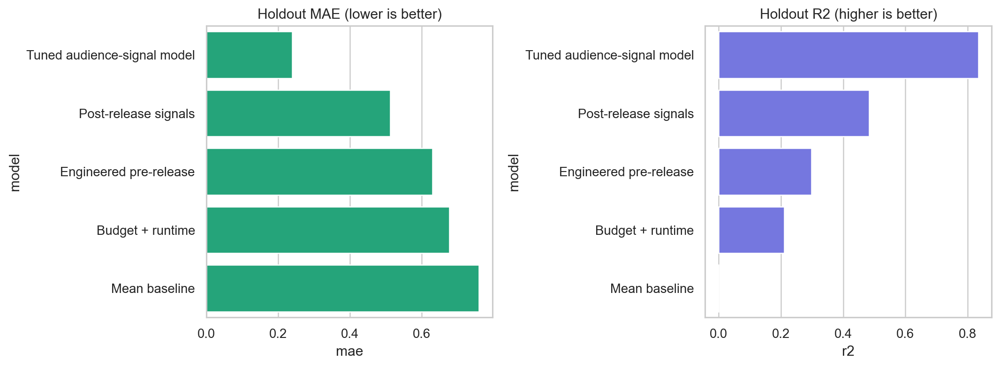
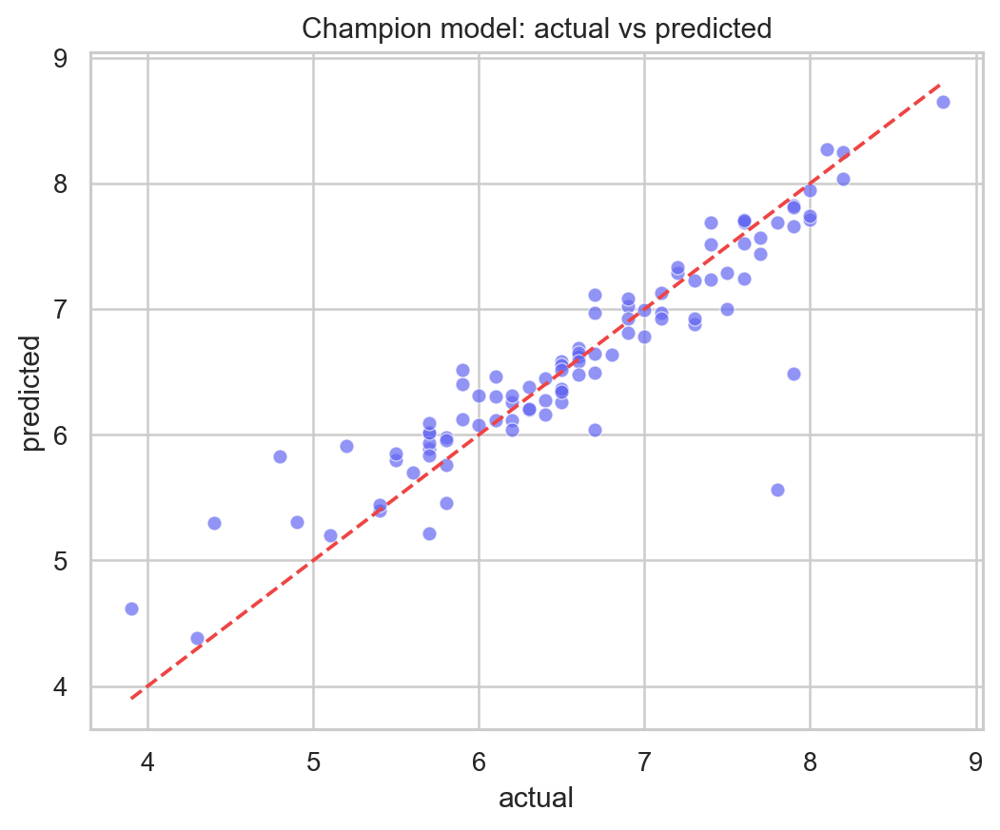
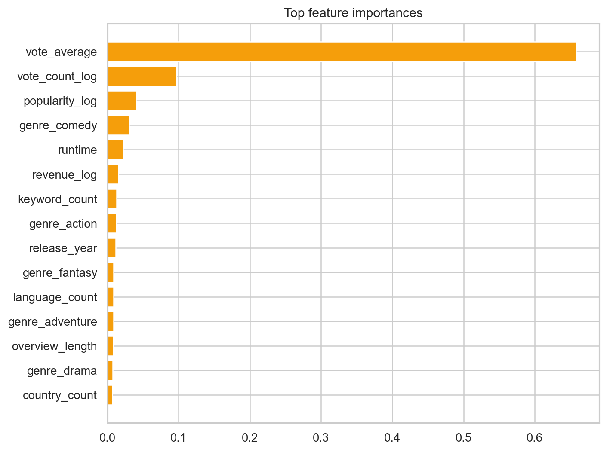

# CineScore ML

An end-to-end machine learning project that estimates IMDb movie ratings from
TMDB metadata and OMDb labels. It includes resumable API collection, feature
engineering, model tuning, holdout evaluation, saved artifacts, automated
tests, and an interactive Streamlit dashboard.



## Verified Results

| Model | Feature availability | MAE | MSE | R2 |
|---|---|---:|---:|---:|
| Mean baseline | None | 0.760 | 0.897 | -0.001 |
| Budget + runtime | Pre-release | 0.677 | 0.708 | 0.210 |
| Engineered pre-release | Pre-release | 0.630 | 0.629 | 0.298 |
| Post-release signals | Post-release | 0.512 | 0.463 | 0.484 |
| Tuned audience-signal model | Post-release | **0.239** | **0.148** | **0.835** |

The champion lowers MAE by **68.5%** against the mean baseline. Results use a
fixed 80/20 holdout split, while `GridSearchCV` tunes only on the training
partition.

> The champion uses TMDB `vote_average`, which is a cross-platform audience
> signal closely related to IMDb rating. It is useful for post-release rating
> estimation, not as a pre-release quality forecast. The pre-release model is
> reported separately to make that boundary explicit.

## What This Demonstrates

- Reproducible Python and scikit-learn pipelines
- Genre multi-hot encoding and numeric feature engineering
- MAE, MSE, and R2 evaluation on an untouched holdout set
- GridSearchCV tuning for an Extra Trees regressor
- Resumable OMDb collection with local caching
- Model artifacts, error analysis, and feature importance
- Automated feature tests and an interactive dashboard

## Data

- **TMDB:** 4,803 cleaned movie records and 20 source columns
- **OMDb:** 491 verified IMDb labels currently cached
- **Collector:** resumable API pipeline for optional future OMDb enrichment

The raw source files are preserved under `data/data/`. See
[DATA_CARD.md](docs/DATA_CARD.md) for coverage and limitations.

## Quick Start

```powershell
python -m venv .venv
.\.venv\Scripts\python -m pip install -r requirements.txt
$env:PYTHONPATH = "src"
.\.venv\Scripts\python -m cine_ml.train
.\.venv\Scripts\python -m streamlit run app.py
```

Run tests:

```powershell
.\.venv\Scripts\python -m pytest -q
```

## Expand the OMDb Dataset

Create a fresh OMDb key, then run:

```powershell
$env:PYTHONPATH = "src"
$env:OMDB_API_KEY = "your-key"
.\.venv\Scripts\python -m cine_ml.collect_omdb --target 1100
.\.venv\Scripts\python -m cine_ml.train
```

The collector reuses cached records, skips duplicate titles, handles missing
ratings, and writes `data/data/omdb_movies.csv`.

## Project Structure

```text
app.py                         Streamlit model dashboard
src/cine_ml/collect_omdb.py    Resumable OMDb data collection
src/cine_ml/features.py        Data loading and feature engineering
src/cine_ml/train.py           Training, tuning, evaluation, artifacts
tests/                         Automated feature tests
artifacts/                     Metrics, predictions, model, importance
reports/figures/               Analysis charts
docs/                          Data card and model card
data/Movie.ipynb               Original exploratory analysis
```




